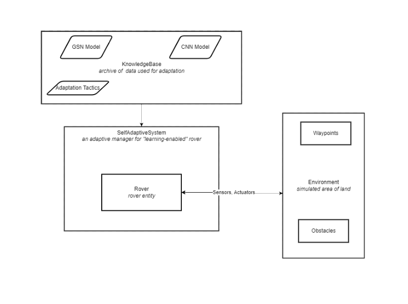
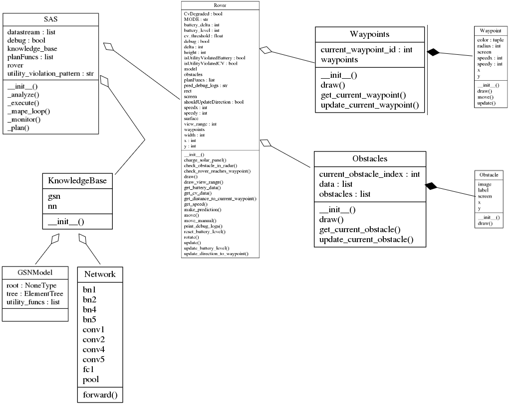
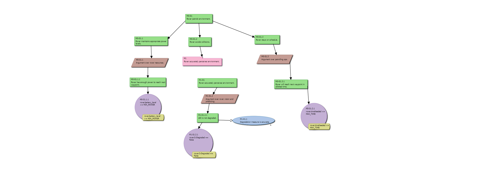
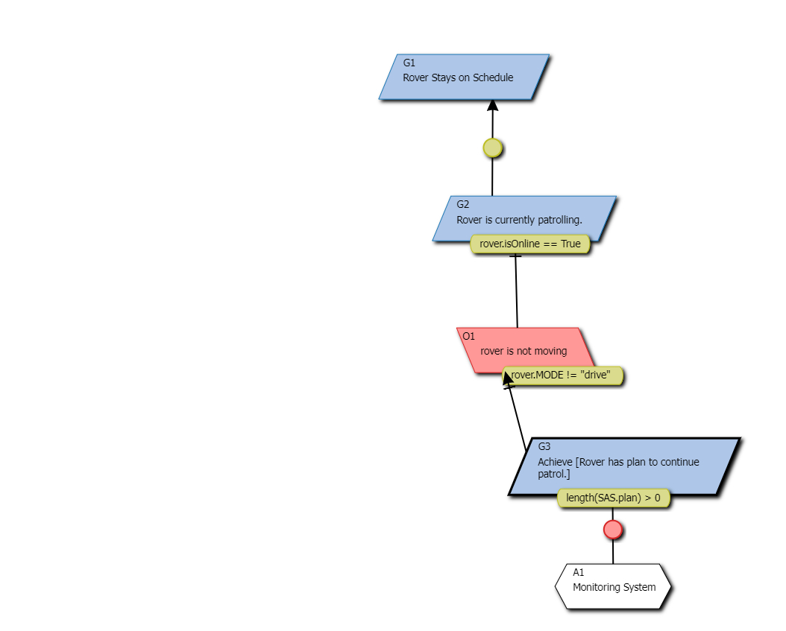

# Adaptive Rover 2D Simulation

### Goal
The goal of this project was to better understand GSN model creation via GSNDraw and experiment with structured assurance cases for LESs. This application is a simplified model of a MAPE-K based control system that adapts to a changing environment.

This rover is heavily inspired and designed after the AC-ROS framework presented [here](https://dl.acm.org/doi/10.1145/3365438.3410952)

## High-level Architecture Overview
<!--  -->


## Description
This simulation consists of 4 main components, a rover, an adaptive manager, a knowledge base, and an environment. 

### 1. Rover
The rover is designed to patrol waypoints iteratively while avoiding obstacles, maintaining appropriate battery levels, and staying on schedule. The rover has a *camera* able to detect objects within a specified range. If an obstacle is detected within this range, the rover's LEC is enabled. 

#### 1.1 Rover's LEC
The rover's LEC is a convolutional neural network trained on the CIFAR10 dataset. When the rover detects an obstacle within a specified range, it uses the CNN to classify the object. If the rover makes a correct prediction, the obstacle is *avoided* and moved to a new position. If the rover makes an incorrect guess, it is an indication of LEC degradation. In the real world, water droplets covering the camera, or very foggy weather, may be a cause of such degradation (mispredictions). If the LEC is degraded, the rover enters manual mode and the user must use arrow keys to navigate it to the target waypoint. 

This flow for detecting objects is a "dummy" way to check if the LEC is degraded. This mimics the behavior oracle described in MoDALAS by ensuring the system is able to know when it encounters an obstacle it is not equipped to handle. 

### 2. SAS (SelfAdaptiveSystem)
This system consists of a knowledge base and a given rover to manage. The SAS follows the MAPE-K control loop on each step of the simulation. (1. Monitor) First, the SAS monitors the rover's environment and internal state by requesting various data from the rover (loosely emulates ROS topic requests). (2. Analyze) This data is then analyzed and a utility violation pattern is generated. (3. Plan) Based on the violation pattern, the rover pushes commands to queue. (4. Execute) This queue is then iterated, executing each command and finally cleaning up any single-loop scoped variables.  

#### 2.1 Assurance Case provided by GSN

This model is parsed and utility functions extracted for later use by the SAS. It is important to note that this model specifically addresses run-time goals. Additional design time goals, such as DNN testing, formal verification, additional system analysis are not included. These are important aspects of an assurance case and should be included in future updates to the goal model/system. <br/>
<br/>
Additionally, An incoming update will replace Solution `M0-S1.2.1` with a KAOS goal evaluation as pictured below:



#### 2.2 Adaptation Tactics
These are designed after creating the GSN model and map utility violation patterns to actions that the rover can carry out.
```python
# SAS.py
...
tactics = {
    "11": [],
    "01": ['self.rover.MODE="charge"', "self.isUtilityViolatedBattery = False"],
    "10": ['self.rover.MODE="manual"', "self.isUtilityViolatedCV = False"],
    "00": [
        'self.rover.MODE="charge"',
        "self.isUtilityViolatedBattery = False",
        'self.rover.MODE="manual"',
        "self.isUtilityViolatedCV = False",
    ],
}
...
```
#### 2.3 CNN Model
This is trained and stored prior to deployment of the rover.

### 3. Environment
The environment is a custom simulated field hosted by pygame 2d graphics library. The environment consists of waypoints that the rover must reach, and obstacles for the rover to avoid. The rover has direct access to this environment. 
___
## Demo
*please note: The simulated environment is running on Win10 wsl2 and displayed through a local X11 server. This causes visual artifacts during simulation recording which are visible below but not present when running the simulation.*


This demo shows some of the adaptive capabilities of the rover. When the battery utility function is violated, the rover takes the `solar_charge` tactic that causes it to switch to *charge* mode, stop moving, and charge until battery level is sufficient. The live demo has a real-time terminal based dashboard displaying various rover/system logs. 

___
## Todo
- [ ] better obstacle placement
- [ ] KAOS goal model

## Citations
- https://www.cs.toronto.edu/~kriz/cifar.html
- https://dl.acm.org/doi/10.1145/3365438.3410952
- https://www.pygame.org/docs/
- https://cse.msu.edu/~langfo37/gsndraw/
- https://cse.msu.edu/~langfo37/kaosdraw/
- https://learn.microsoft.com/en-us/windows/ai/windows-ml/tutorials/pytorch-train-model
- https://ieeexplore.ieee.org/document/9592499 

### Assets
- [bg surface](https://www.google.com/https%3A%2F%2Fforum.flightgear.org%2Fviewtopic.php%3Ff%3D5%26t%3D37950)
